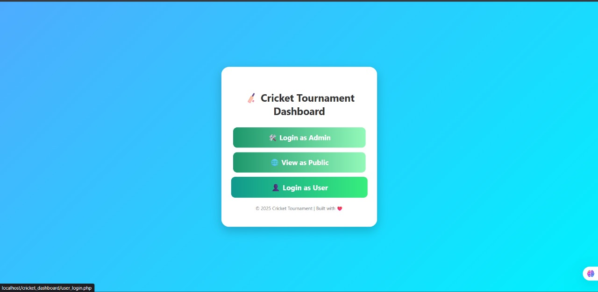
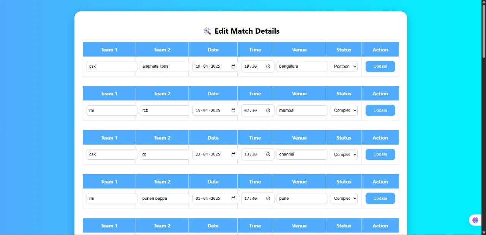
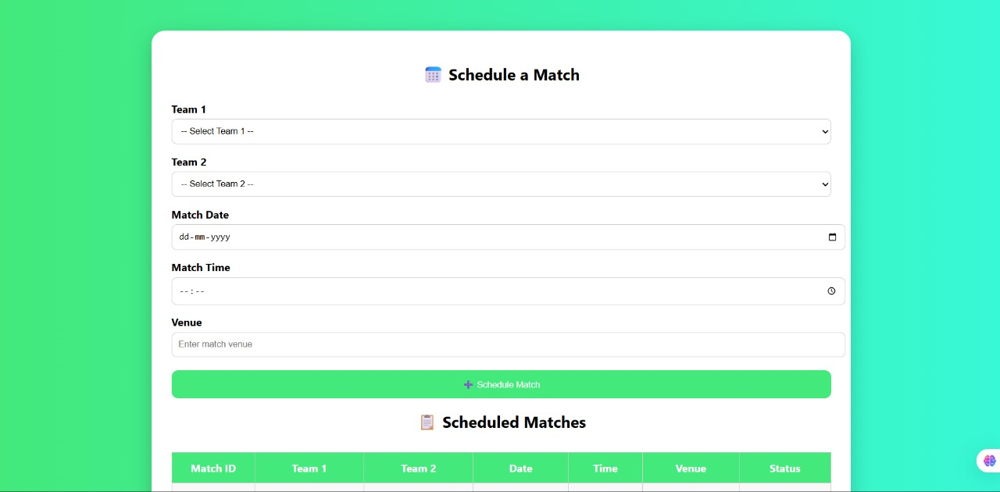
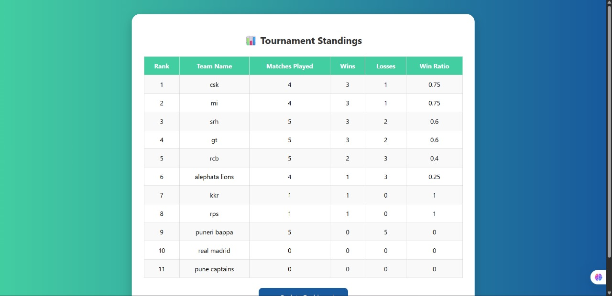
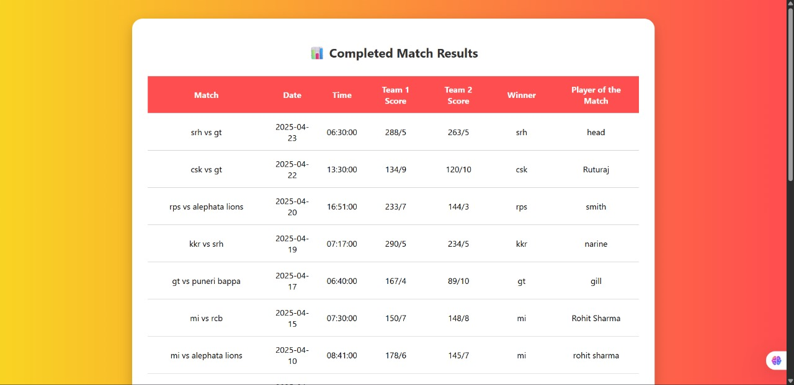
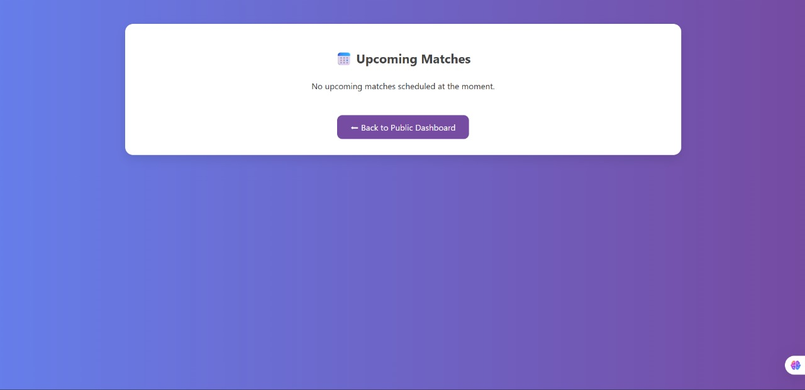

# 🏏 Cricket Dashboard

Cricket Dashboard is a web-based tournament management system built with PHP and MySQL. It allows administrators to manage teams, players, schedules, and results, while users can view match updates, standings, and player details. This project is designed for local tournaments, clubs, and sports events.

## 📸 Screenshots

Here are screenshots of the dashboard in action:

**Main Login Page**


**Admin Match Management**


**Match Scheduling Interface**


**Tournament Standings**


**Match Results Dashboard**


**Upcoming Matches View**


## 🚀 Features

- 👤 **User Management:** Registration & login for users, admin login for management
- 🏏 **Team & Player Management:** Add/view teams and players
- 📅 **Match Scheduling:** Schedule upcoming matches and edit details
- 📝 **Results Management:** Enter and update match results
- 📊 **Standings & Results:** View results, leaderboards, and standings
- 🌐 **Public Dashboard:** Open access to schedules and results

## 🛠️ Tech Stack

- **Frontend:** PHP (server-side rendering)
- **Backend:** PHP with MySQL
- **Database:** MySQL (`db_connection.php` for DB setup)

## 📂 Project Structure

```
cricket_dashboard/
├── index.php                # Landing page
├── admin_login.php          # Admin authentication
├── admin_dashboard.php      # Admin panel
├── team_dashboard.php       # Team dashboard
├── user_login.php           # User login
├── user_register.php        # User registration
├── add_team.php             # Add new team
├── add_players.php          # Add new players
├── schedule_matches.php     # Match scheduling
├── enter_results.php        # Enter results
├── edit_match.php           # Edit match details
├── match_results.php        # View match results
├── view_standings.php       # View standings
├── view_upcoming_matches.php# Upcoming matches
├── view_teams.php           # Team list
├── view_players.php         # Player list
├── db_connection.php        # Database connection
└── logout.php               # Logout
```

## ⚡ Installation & Setup

# Cricket Tournament Dashboard

## Prerequisites

Ensure you have a local server environment like **XAMPP**, **WAMP**, or **MAMP** installed, which includes Apache, MySQL, and PHP.

## Installation

### 1. Clone the Repository

Open your terminal or command prompt and run the following command to clone the project:

```bash
git clone https://github.com/ShrikarBende/Cricket-Tournament-Dashboard.git
cd Cricket-Tournament-Dashboard
```

### 2. Set Up the Database

1. Start the **Apache** and **MySQL** services from your XAMPP/WAMP control panel.
2. Open your web browser and navigate to `http://localhost/phpmyadmin`.
3. Create a new database and name it `cricket_db`.
4. Select the `cricket_db` database and go to the **SQL** tab.
5. Copy and execute the following SQL schema to create the necessary tables:

```sql
CREATE TABLE admins (
    id INT(11) AUTO_INCREMENT PRIMARY KEY,
    username VARCHAR(50) NOT NULL UNIQUE,
    password VARCHAR(255) NOT NULL
);

CREATE TABLE users (
    id INT(11) AUTO_INCREMENT PRIMARY KEY,
    username VARCHAR(50) NOT NULL UNIQUE,
    password VARCHAR(255) NOT NULL,
    email VARCHAR(100) NOT NULL UNIQUE
);

CREATE TABLE teams (
    team_id INT(11) AUTO_INCREMENT PRIMARY KEY,
    team_name VARCHAR(100) NOT NULL,
    logo_path VARCHAR(255)
);

CREATE TABLE players (
    player_id INT(11) AUTO_INCREMENT PRIMARY KEY,
    player_name VARCHAR(100) NOT NULL,
    team_id INT(11),
    role VARCHAR(50),
    FOREIGN KEY (team_id) REFERENCES teams(team_id)
);

CREATE TABLE matches (
    match_id INT(11) AUTO_INCREMENT PRIMARY KEY,
    team1_id INT(11) NOT NULL,
    team2_id INT(11) NOT NULL,
    match_date DATE,
    venue VARCHAR(100),
    status VARCHAR(50) DEFAULT 'Upcoming',
    winner_id INT(11) NULL,
    team1_score VARCHAR(50) NULL,
    team2_score VARCHAR(50) NULL,
    FOREIGN KEY (team1_id) REFERENCES teams(team_id),
    FOREIGN KEY (team2_id) REFERENCES teams(team_id)
);

-- (Optional) Insert a default admin user for login
INSERT INTO `admins` (`username`, `password`) VALUES ('admin', 'admin123');
```

### 3. Configure the Database Connection

Open the `db_connection.php` file and ensure the database credentials match your local setup. The default configuration should work for most XAMPP installations:

```php
<?php
$servername = "localhost";
$username = "root";
$password = "";
$dbname = "cricket_db";

$conn = mysqli_connect($servername, $username, $password, $dbname);

if (!$conn) {
    die("Connection failed: " . mysqli_connect_error());
}
?>
```

### 4. Run the Project

1. Move the entire project folder (`Cricket-Tournament-Dashboard`) into your server's root directory:
   - **XAMPP**: `htdocs` folder
   - **WAMP**: `www` folder
   - **MAMP**: `htdocs` folder

2. Open your web browser and navigate to:
   ```
   http://localhost/Cricket-Tournament-Dashboard/
   ```

You should now see the main login page! You can log in as an admin using the default credentials:
- **Username**: `admin`
- **Password**: `admin123`


## Support

If you encounter any issues during setup, please check that:
- Your local server (Apache/MySQL) is running
- Database credentials in `db_connection.php` are correct
- The project folder is in the correct server directory

## 🎯 Use Cases

- College / School tournaments
- Local cricket leagues
- Club-level competitions
- Sports event management


## 🤝 Contributing

Contributions are welcome! Feel free to fork this repository, create a new branch, and submit a pull request.

## 📜 License

This project is open-source and available under the MIT License.
